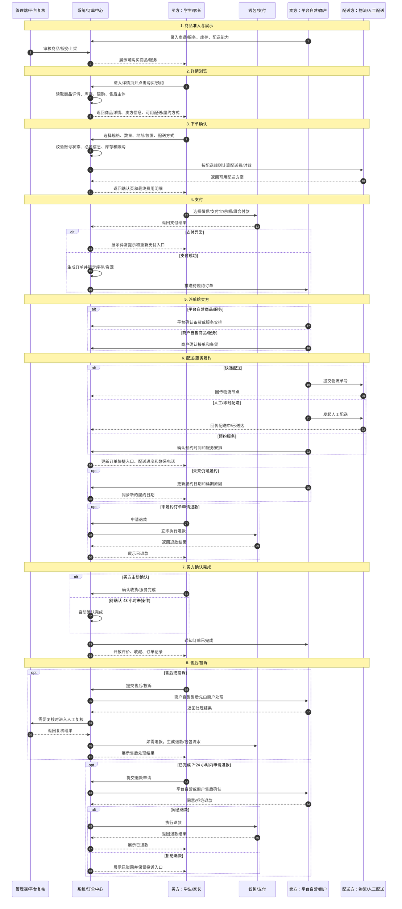
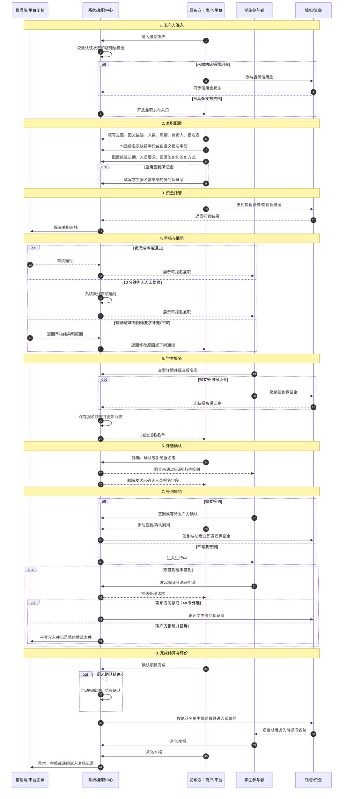
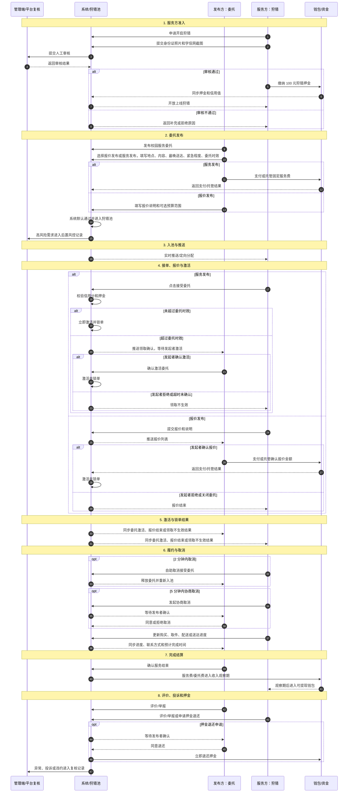
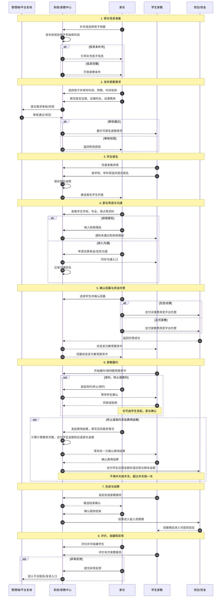

# 佚名用户端业务链路图

> 更新时间：2026-07-08  
> 范围：基于 `client-plan.md` 和 `admin-plan.md` 当前已梳理内容，按购买、兼职、委托/狩猎、家教 4 个用户端高频场景整理可视化业务链路。  
> 说明：以下图使用 Mermaid，可在支持 Mermaid 的 Markdown 查看器中渲染。每张图按参与角色分泳道，实线为主链路，虚线为异常、投诉或后续补充链路。

## 阅读方式

- 先看每个场景的阶段表，确认每一阶段有哪些角色参与。
- 再看 Mermaid 泳道图，沿主链路检查用户动作、系统状态、资金流和管理端介入点。
- 最后看第一版边界，确认哪些能力已经闭合，哪些复杂争议或规则暂时不展开。

## 1. 购买场景

角色分工：

| 角色 | 主要职责 | 关键入口/动作 |
| --- | --- | --- |
| 买方：学生/家长 | 浏览、下单、支付、查看进度、确认完成、评价/投诉 | 优选/商品列表、详情页、订单快捷入口、我的订单 |
| 系统/订单中心 | 校验账号、库存、限购、地址/位置、配送方式，生成订单并推动状态流转 | 下单确认页、订单状态、消息通知 |
| 钱包/支付 | 收款、支付异常提示、退款和钱包流水 | 微信、支付宝、余额、组合付款 |
| 卖方：平台自营/商户 | 备货、接单、发起配送或预约服务，处理商户自售售后 | 商户销售工作台、配送入口、售后消息 |
| 配送方：物流/人工配送 | 承接快递、人工配送、即时配送，回传配送状态 | 物流单号、配送中、已送达 |
| 管理端/平台复核 | 商品审核、投诉复核、异常记录和信用候选事件记录 | 商品审核、售后投诉、账号/信用管理 |

阶段流转：

| 顺序 | 阶段 | 触发角色 | 系统状态 | 下一处理角色 | 说明 |
| --- | --- | --- | --- | --- | --- |
| 1 | 商品展示 | 管理端、卖方 | 可展示/可购买 | 买方 | 商品或服务审核通过后进入列表；家长端仅展示可快递履约商品 |
| 2 | 下单确认 | 买方 | 待确认 | 系统/订单中心 | 校验账号状态、库存、限购、地址/位置、配送或服务方式 |
| 3 | 支付提交 | 买方 | 待支付/支付异常/已支付 | 钱包/支付 | 第一版支持微信、支付宝、余额和组合付款 |
| 4 | 订单生成 | 系统/订单中心 | 待配送/备货中 | 卖方 | 支付成功后生成订单，锁定库存或服务资源；预售产品、接收备货商品和需备货商品统一进入待配送/备货中 |
| 5 | 备货接单 | 卖方 | 待配送/备货中 | 配送方 | 平台自营由平台履约，商户商品/服务由商户自售履约 |
| 6 | 配送履约 | 配送方 | 配送中/已送达 | 买方 | 快递、人工配送或即时配送回传配送状态；预约服务完成后进入待确认 |
| 7 | 买方确认 | 买方、系统 | 待确认/已完成 | 系统/订单中心 | 买方确认收货或服务完成后订单完成；进入待确认后 48 小时未确认则系统自动完成 |
| 8 | 售后投诉 | 买方、卖方 | 退款申请中/售后/投诉/退款中/已退款 | 卖方、管理端、钱包 | 已完成订单 7*24 小时内可申请退款，需同意后进入退款流程；未履约订单买方申请退款立即执行 |

环节角色关系拆解：

| 环节 | 参与角色 | 链路关系 | 输出/状态 |
| --- | --- | --- | --- |
| 1. 商品准入与展示 | 卖方、管理端、系统、买方 | 卖方录入商品或服务信息，管理端审核，系统根据商品状态、库存、配送能力和买方角色展示列表 | 可展示、可购买、不可展示 |
| 2. 详情浏览 | 买方、系统、卖方 | 买方进入详情页，系统读取商品详情、库存、限购、售后主体和可用配送方式，卖方信息作为履约与咨询来源 | 可下单、不可下单、需补充信息 |
| 3. 下单确认 | 买方、系统、配送方 | 买方选择规格、数量、地址/位置和配送方式，系统按配送规则计算服务费、物流费和最终金额 | 待确认、待支付 |
| 4. 支付 | 买方、钱包/支付、系统 | 买方发起支付，钱包/支付返回结果；失败则回到支付确认，成功则系统生成订单并锁定库存/服务资源 | 支付异常、已支付、待履约 |
| 5. 派单给卖方 | 系统、卖方、买方 | 系统将已支付订单推送给平台自营或商户，卖方确认接单、备货或安排预约服务；未来仍可履约时，商户可更新履约日期并同步买方 | 待配送/备货中、履约延期 |
| 6. 配送/服务履约 | 卖方、配送方、系统、买方 | 卖方选择快递、人工/即时配送或预约服务；配送方回传物流或配送节点，系统同步进度、联系电话和预计送达时间给买方；未履约订单买方申请退款时立即执行退款 | 配送中、已送达、待确认、已退款 |
| 7. 买方确认完成 | 买方、系统、卖方 | 买方确认收货或服务完成，或待确认 48 小时后系统自动完成；已完成订单展示评价快捷入口、收藏入口和历史记录 | 已完成 |
| 8. 售后/投诉 | 买方、系统、卖方、管理端、钱包/支付 | 买方提交售后或投诉；已完成订单 7*24 小时内可申请退款，平台自营或商户售后同意后才进入退款流程；需要平台复核时进入管理端，涉及退款时由钱包记录流水 | 退款申请中、售后中、投诉中、退款中、已退款、已关闭 |

关键状态：待支付、支付异常、待配送/备货中、履约延期、配送中、已送达、待确认、已完成、退款申请中、售后/投诉、退款中/已退款。可评价不是订单状态，是已完成订单上的快捷入口，点击后跳转商品详情评价入口。

第一版边界：

- 家长购买只走快递配送。
- 商户商品/服务为商户自售，平台不作为默认卖方。
- 订单进入待确认后 48 小时自动完成；完成后 7*24 小时内可申请退款，需售后同意后进入退款流程。
- 未履约订单买方申请退款立即执行；未来仍可履约时，商户可更新履约日期，买方未申请退款则继续等待履约。
- 评价入口保留在商品详情页，可选择匿名；同一订单只允许追评一次。
- 第一版默认交易正常完成且无争议；复杂举证、赔付、保证金扣减和跨渠道退款拆分后续补充。

## 2. 兼职场景

角色分工：

| 角色 | 主要职责 | 关键入口/动作 |
| --- | --- | --- |
| 发布方：商户/平台 | 发布兼职、配置报名表、人员要求、签到规则、结算日期，筛选并确认报名者 | 商户兼职工作台、兼职发布、报名名单、项目结束确认 |
| 学生参与者 | 浏览兼职、报名、缴纳可选签到保证金、签到履约、查看结算、评价/举报 | 兼职列表、兼职详情、报名表、我的兼职 |
| 系统/兼职中心 | 校验发布资格、审核流转、报名状态、邮件通知、自动结束、结算规则 | 兼职审核、报名快照、状态流转、消息通知 |
| 钱包/资金 | 岗位预算托管、店铺信用金、签到保证金冻结/退还、兼职结算 | 支付、冻结、退还、观察期、可提现 |
| 管理端/平台复核 | 审核兼职、处理违规下架、介入保证金拒绝退还和异常投诉 | 兼职审核、投诉复核、信用候选事件 |

阶段流转：

| 顺序 | 阶段 | 触发角色 | 系统状态 | 下一处理角色 | 说明 |
| --- | --- | --- | --- | --- | --- |
| 1 | 发布方准入 | 发布方、系统、钱包 | 待缴纳/已缴纳店铺信用金 | 发布方 | 商户认证通过后，销售或发布兼职前需缴纳店铺信用金 |
| 2 | 兼职配置 | 发布方 | 待提交 | 系统/兼职中心 | 填写主题、图文描述、人数、周期、报名表、结算日期、人员要求、是否签到和签到方式；报名表支持快捷字段和自定义字段 |
| 3 | 资金托管 | 发布方、钱包 | 待支付/已托管 | 系统/兼职中心 | 发布方支付岗位预算，发布兼职时可选签到保证金 |
| 4 | 审核展示 | 系统、管理端 | 审核中/招募中/已驳回 | 学生参与者 | 普通兼职审核 10 分钟内无人工处理则系统默认通过，审核通过后进入兼职列表 |
| 5 | 报名与保证金 | 学生参与者、系统、钱包 | 已报名/待筛选 | 发布方 | 学生填写报名表；如启用签到保证金，报名时缴纳并冻结 |
| 6 | 筛选确认 | 发布方、系统 | 未通过/已确认/待签到 | 学生参与者 | 发布方筛选人员，系统同步报名状态，并将报名字段邮件发送给发布方 |
| 7 | 签到履约 | 学生参与者、发布方、系统、钱包 | 已签到/进行中/未签到/异常 | 发布方、管理端 | 签到成功退还保证金；忘签到或未签到可发起退还申请 |
| 8 | 完成结算 | 发布方、系统、钱包 | 已完成/结算中/已结算 | 学生参与者 | 发布方确认结束或一周后自动确认，费用进入观察期后转可提现钱包 |

环节角色关系拆解：

| 环节 | 参与角色 | 链路关系 | 输出/状态 |
| --- | --- | --- | --- |
| 1. 发布方准入 | 发布方、系统、钱包 | 发布方进入兼职发布前，系统校验认证状态和店铺信用金；未缴纳则先跳转缴纳 | 可发布、不可发布、待缴纳 |
| 2. 兼职配置 | 发布方、系统 | 发布方填写兼职主题、图文描述、人数、周期、负责人、报名表、结算日期、人员要求和签到方式；报名表可勾选籍贯、年龄、身高、性别、体重、近视、是否本地等快捷字段，也可自定义输入字段 | 待提交、待支付 |
| 3. 资金与保证金配置 | 发布方、钱包、系统 | 发布方支付岗位预算；可选配置签到保证金，学生报名时再缴纳并冻结 | 已托管、保证金规则已配置 |
| 4. 审核与展示 | 发布方、系统、管理端、学生 | 系统提交审核，管理端可人工通过、拒绝或要求补充；普通兼职 10 分钟内无人工处理则系统默认通过并展示给学生 | 审核中、招募中、已驳回、已下架 |
| 5. 学生报名 | 学生、系统、钱包、发布方 | 学生提交报名表和快照；如需签到保证金则先支付冻结；系统推送报名名单给发布方 | 已报名、待筛选、报名快照 |
| 6. 筛选确认 | 发布方、系统、学生 | 发布方确认或拒绝报名者；不超额时满员自动结束报名，超额时发布方手动确认 | 未通过、已确认、待签到、招募结束 |
| 7. 签到履约 | 学生、发布方、系统、钱包、管理端 | 学生签到或由发布方确认；签到成功退还保证金；忘签到或未签到进入退还申请或平台介入 | 已签到、进行中、未签到、争议处理 |
| 8. 完成结算与评价 | 发布方、系统、钱包、学生、管理端 | 发布方确认项目完成，系统按名单结算；一周未确认自动完成；双方可评价或举报 | 已完成/结算中、已结算、异常、信用候选事件 |

关键状态：已报名、待筛选（仅限差额兼职）、未通过、已确认/待签到、已签到、进行中、已完成/结算中、已结算、未签到、招募取消、异常、争议处理。

第一版边界：

- 店铺信用金是商户入驻后开始销售或发布兼职前的前置条件。
- 签到保证金是单个兼职发布时可选配置，学生报名时缴纳，签到后返还。
- 报名表支持快捷字段：籍贯、年龄、身高、性别、体重、近视、是否本地；发布方也可自定义输入报名字段。
- 兼职描述支持文本编辑和图片上传。
- 第一版普通兼职审核 10 分钟内无人工处理时，系统默认审核通过。
- 发起者拒绝签到保证金退还并投诉时由平台介入；复杂举证和赔付后续补充。

## 3. 委托/狩猎场景

本场景覆盖发布方“委托”和服务方“狩猎”两条角色路径；“狩猎”单独出现时，特指服务方上线、接单和履约能力。

角色分工：

| 角色 | 主要职责 | 关键入口/动作 |
| --- | --- | --- |
| 发布方：委托 | 创建委托、选择报价发布或服务发布、确认报价、确认过期领取激活、确认服务结束 | 发布委托、我的发布、订单快捷入口 |
| 服务方：狩猎 | 完成认证、上线狩猎、接受服务发布、对报价发布提交报价、履约送达、查看结算 | 狩猎按钮、狩猎池、我的委托/狩猎 |
| 系统/狩猎池 | 认证校验、发布默认通过、入池推送、报价流转、激活确认、锁单、状态流转、消息通知 | 狩猎池、实时推送、定向分配、状态机 |
| 钱包/资金 | 100 元狩猎押金、固定服务费、报价确认金额、结算观察期、押金退还 | 支付、冻结、退还、观察期、可提现 |
| 管理端/平台复核 | 人工审核身份证和学信网截图，处理高风险后置风控、异常投诉和信用候选事件 | 认证审核、后置风控、投诉处理 |

阶段流转：

| 顺序 | 阶段 | 触发角色 | 系统状态 | 下一处理角色 | 说明 |
| --- | --- | --- | --- | --- | --- |
| 1 | 服务方准入 | 服务方、系统、管理端、钱包 | 待认证/已认证/可狩猎 | 服务方 | 身份证照片和学信网截图人工审核，通过后缴纳 100 元押金并获得狩猎资格 |
| 2 | 委托发布 | 发布方、系统、钱包 | 系统默认通过/已入池 | 系统/狩猎池 | 发布校园服务需求，选择报价发布或服务发布，填写地点、内容、最晚送达时间、紧急程度和委托时效 |
| 3 | 入池推送 | 系统/狩猎池 | 待领取/待报价 | 服务方 | 需求进入狩猎池，先到先得，也可定向推送给在线服务方 |
| 4 | 接单/报价 | 服务方、发布方、系统 | 报价待确认/待确认激活/已锁单 | 发布方、服务方 | 服务发布可直接接受；报价发布由服务方报价，发布方选择并确认 |
| 5 | 时效与激活 | 系统、发布方 | 待确认激活/已激活/已拒绝 | 服务方 | 超过委托时效仍可领取，领取后推送发起者确认并激活委托 |
| 6 | 履约与取消 | 服务方、发布方、系统 | 进行中/可取消/协商取消中/异常 | 发布方、服务方 | 2 分钟内可取消，5 分钟内可协商取消；多单并行会放大超时信用影响 |
| 7 | 完成结算 | 发布方、服务方、钱包 | 待发布者确认/已完成/观察期/已结算 | 服务方 | 发布方确认服务结束后，费用进入观察期，观察期后进入服务方可提现钱包 |
| 8 | 评价/投诉/押金 | 发布方、服务方、系统、钱包、管理端 | 已评价/投诉中/押金退还中 | 管理端、钱包 | 双方可评价或举报；押金退还申请按确认规则处理 |

环节角色关系拆解：

| 环节 | 参与角色 | 链路关系 | 输出/状态 |
| --- | --- | --- | --- |
| 1. 服务方准入 | 服务方、系统、管理端、钱包 | 学生提交身份证照片和学信网截图，管理端人工审核；通过后缴纳 100 元押金，系统开放狩猎上线能力 | 待认证、已认证、可狩猎 |
| 2. 委托发布 | 发布方、系统、钱包 | 发布方填写委托内容、地点、最晚送达时间、紧急程度和委托时效，选择报价发布或服务发布；服务发布填写固定服务费，报价发布等待服务方报价 | 系统默认通过、已入池 |
| 3. 入池与推送 | 系统、服务方 | 发布后系统默认通过并进入狩猎池，向在线服务方实时推送，也可定向分配；高风险进入后置风控 | 待领取、已推送 |
| 4. 服务发布接单 | 服务方、系统、发布方 | 服务方点击接受服务发布委托，系统校验信用分和押金；未超过时效时直接激活锁单，超过时效时先进入发起者确认激活 | 待确认激活、已锁单、进行中 |
| 5. 报价发布报价 | 服务方、系统、发布方、钱包 | 服务方提交报价，报价无固定有效期；发布方选择并确认报价后支付或托管确认金额，委托激活并锁单 | 报价待确认、报价结束、已锁单 |
| 6. 履约与取消 | 服务方、发布方、系统 | 锁单后进入进行中；2 分钟内服务方可自助取消，5 分钟内可协商取消，超时或拒绝可能影响信用分 | 进行中、可取消、协商取消中、异常 |
| 7. 送达确认与结算 | 服务方、发布方、系统、钱包 | 服务方完成购买/取件/配送并更新进度，发布方确认服务结束后，系统结算固定服务费或确认报价金额进入观察期 | 待发布者确认、观察期、可提现 |
| 8. 评价、投诉和押金 | 发布方、服务方、系统、钱包、管理端 | 服务结束后双方评价；异常进入投诉入口；押金退还申请由发布方确认后，钱包立即退还 | 已评价、投诉中、押金退还中、已退还 |

关键状态：待领取/待报价、报价待确认、待确认激活、已激活、已锁单、进行中、可取消、协商取消中、待送达/待完成、待发布者确认、已完成/观察期、已结算、异常/投诉。

第一版边界：

- 狩猎时间允许跨天，不限制最长时长；不选默认次日 0 点下线。
- 委托创建审批第一版系统默认通过；高风险需求进入后置风控、人工对接或暂停推送处理。
- 发布方可选择报价发布或服务发布；报价发布由服务方报价后发布方选择并确认，服务发布为固定服务费。
- 超过委托时效的委托仍可被领取，但领取后需推送给发起者确认并激活，确认后才继续后续履约流程。
- 第一版默认校园服务交易正常完成且无争议；异常只保留反馈、投诉和平台联系入口。

## 4. 家教场景

角色分工：

| 角色 | 主要职责 | 关键入口/动作 |
| --- | --- | --- |
| 家长 | 绑定孩子信息、发布家教需求、筛选学生、沟通、确认招募、确认结束、评价/收藏 | 家教列表、发布家教、我的兼职、孩子信息 |
| 学生家教 | 完善家教资质、筛选家教需求、报名、履约、发起完成、查看结算 | 家教列表、家教详情、我的兼职、家教资质 |
| 系统/家教中心 | 校验孩子信息、展示需求、保存报名快照、状态流转、改约/终止/爽约确认、费用结算计算、消息通知 | 家教需求、报名名单、状态机、消息 |
| 钱包/资金 | 家长费用托管、试课费用托管、学生收入观察期、可提现钱包 | 支付、托管、结算、观察期、提现 |
| 管理端/平台复核 | 审核需求、处理异常反馈、记录投诉和信用候选事件 | 需求审核、异常复核、账号/信用管理 |

阶段流转：

| 顺序 | 阶段 | 触发角色 | 系统状态 | 下一处理角色 | 说明 |
| --- | --- | --- | --- | --- | --- |
| 1 | 需求准备 | 家长、系统 | 待补充/可发布 | 家长 | 家长绑定孩子信息，发布家教时强校验年级和科目 |
| 2 | 发布家教 | 家长、系统、管理端 | 审核中/招募中/已驳回 | 学生家教 | 选择孩子，填写科目、预算、是否试课、试课时长和试课费用 |
| 3 | 学生报名 | 学生家教、系统 | 已报名 | 家长 | 学生按学校、学科筛选需求后报名，系统保存报名快照 |
| 4 | 家长筛选 | 家长、系统、学生家教 | 沟通中/已拒绝/待确认 | 学生家教 | 家长查看学校、专业、绩点等资料，可拒绝并填写理由，也可交换电话沟通 |
| 5 | 确认托管 | 家长、钱包、系统 | 已确认/待托管/教育服务中 | 学生家教 | 家长选定学生并确认招募，费用进入平台托管 |
| 6 | 服务履约 | 家长、学生家教、系统 | 教育服务中/改约待确认/终止待确认/费用结算待确认/爽约待确认 | 家长、学生家教 | 改约、终止或爽约需要一方发起、另一方确认；费用按实际服务天数占比计算 |
| 7 | 完成结算 | 学生家教、家长、系统、钱包 | 学生发起完成/家长结束确认/结算中/已结算 | 学生家教、家长 | 正常完成或双方确认提前结算后，费用支付给学生并按规则退还家长 |
| 8 | 评价收藏 | 家长、学生家教、系统、管理端 | 已评价/已收藏/异常 | 管理端 | 双方互评，家长可收藏优秀学生，异常进入平台联系入口 |

环节角色关系拆解：

| 环节 | 参与角色 | 链路关系 | 输出/状态 |
| --- | --- | --- | --- |
| 1. 家长信息准备 | 家长、系统 | 家长可跳过孩子信息补充，但发布家教时系统强校验孩子年级和科目 | 待补充、可发布 |
| 2. 发布家教需求 | 家长、系统、管理端 | 家长选择孩子，填写学科、预算、时间、是否试课、试课时长和试课费用；系统提交审核或风控 | 审核中、招募中、已驳回 |
| 3. 学生报名 | 学生家教、系统、家长 | 学生完善家教资质后按学校、学科筛选需求并报名，系统保存报名快照并推送给家长 | 已报名、报名快照 |
| 4. 筛选与沟通 | 家长、系统、学生家教 | 家长查看学生资料，可拒绝并填写理由，也可交换电话和信息沟通 | 已拒绝、沟通中、待确认 |
| 5. 确认招募与资金托管 | 家长、系统、钱包、学生家教 | 家长选择学生并确认招募，支付家教费用或试课费用至平台托管，系统将状态改为教育服务中 | 待托管、教育服务中 |
| 6. 家教履约 | 家长、学生家教、系统、钱包 | 服务过程中如需改约、终止或处理爽约，由一方发起、另一方确认；涉及费用变化时，系统按实际服务天数占比计算应付学生金额和应退家长金额 | 教育服务中、改约待确认、终止待确认、费用结算待确认、爽约待确认 |
| 7. 完成与结算 | 学生家教、家长、系统、钱包 | 正常完成时学生发起完成、家长确认；提前终止或改约结算时一方发起费用结算、另一方确认后执行支付和退款 | 家长结束确认、结算中、已结算 |
| 8. 评价、收藏和异常 | 家长、学生家教、系统、管理端 | 双方评价本次服务，家长可收藏学生；异常反馈进入平台联系入口 | 已评价、已收藏、异常 |

关键状态：招募中、已报名、沟通中、已确认/待托管、教育服务中、改约待确认、终止待确认、费用结算待确认、爽约待确认、学生发起完成、家长结束确认、已结束/结算中、已结算、异常。

第一版边界：

- 家长发起家教时可填写是否试课、试课时长和试课费用。
- 周期课第一版拆成单次或阶段需求，不做复杂课时包。
- 改约、终止或爽约需要一方发起、另一方确认后才可结束对应操作。
- 家教服务中发生终止或改约并涉及费用变化时，由一方发起费用结算，另一方确认后按实际服务天数占比支付或退还金额；不满半天按半天，超过半天按一天。
- 第一版暂不展开家教争议举证、赔付和复杂仲裁。

## 5. 后续调整建议

| 优先级 | 建议调整点 | 对应场景 |
| --- | --- | --- |
| P1 | 信用分专项规则：分值、档位、恢复、申诉、跨模块影响 | 购买、兼职、委托/狩猎、家教 |
| P1 | 钱包记录统计口径和资金对账细则 | 购买、兼职、委托/狩猎、家教 |
| P2 | 完整争议举证赔付链路 | 购买、兼职、委托/狩猎、家教 |
| P2 | 商户营销活动细化 | 购买、商户经营 |
| P2 | 商户信用与处罚策略 | 购买、兼职、商户经营 |
