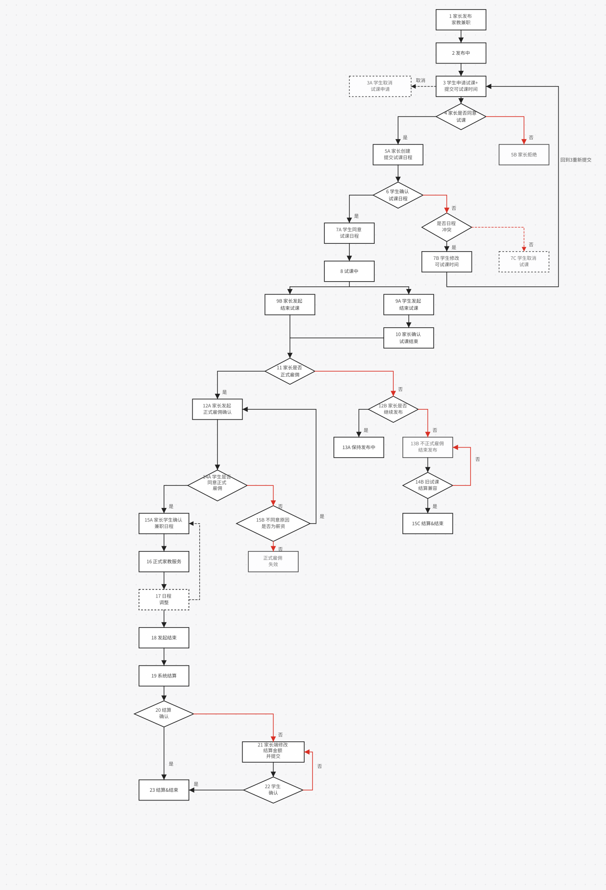

# 家教兼职流程图

> 更新时间：2026-09-01
> 范围：家长发布家教兼职、学生申请试课、取消试课、试课结束确认、正式雇佣确认、正式服务结束结算。
> 说明：第 3 节直接引用 SVG 流程图。本文描述产品目标流程；申请阶段和试课/服务阶段是同一个统一申请列表的两个逻辑阶段，不代表两个页面入口。

## 1. 状态口径

家教兼职需要区分“家长发布需求主状态”和“学生申请/服务状态”。家长端发布后，需求可以保持“发布中”，同时叠加学生的“试课中”状态；同一个家教需求允许多名学生同时试课，每名学生的申请、试课、结束试课和结算状态相互独立；学生同意正式雇佣并提交可家教日期后，需求主状态立即进入“进行中”，该兼职不再出现在学生端兼职列表，也不再允许其他学生申请试课；家长提交正式雇佣日程后，当前学生申请状态进入“正式雇佣”。

| 层级 | 状态 | 归属 | 说明 |
| --- | --- | --- | --- |
| 需求主状态 | 待发布 | 家长端需求 | 家长取消发布已发布且尚未安排试课的家教兼职后进入；学生端不可搜索和申请 |
| 需求主状态 | 发布中 | 家长端需求 | 家长已发布家教兼职，仍可接收学生申请；家长端进行中卡片展示取消发布按钮 |
| 申请状态 | 申请试课中 | 学生申请 | 学生已申请试课，等待家长同意或拒绝 |
| 申请终态 | 已取消 | 学生申请 | 学生在家长处理前取消申请，或在日程确认阶段取消试课后，当前申请结束；家长需求仍为发布中 |
| 申请终态 | 已失效 | 学生申请 | 家长拒绝试课后，学生端该申请失效；家长需求仍为发布中 |
| 日程确认 | 试课日程确认中 | 学生申请 | 家长从统一申请列表为当前申请提交独立试课日程，学生确认后进入试课中；当前不收集或校验学生可试课时间 |
| 试课状态 | 试课中 | 学生申请、家长统一申请列表卡片（试课/服务阶段） | 家长同意试课后，学生端进入试课中；家长端需求主任务卡片仍只显示需求状态 |
| 试课确认 | 结束试课确认中 | 学生申请 | 学生发起结束试课后等待家长确认；家长发起结束试课时跳过该确认 |
| 试课费用确认 | 结算确认中 | 学生申请、家长统一申请列表 | 家长发起结束试课，或学生发起结束试课且家长确认时，必须先确认试课结算金额；金额写入申请记录后进入该状态，等待学生确认费用 |
| 试课结果决策 | 试课已结算、等待正式雇佣 | 学生申请、家长统一申请列表 | 学生确认试课费用后进入该状态，家长再处理是否正式雇佣 |
| 试课终态 | 试课已结束 | 学生申请 | 学生已确认试课费用且家长选择不正式雇佣后，本次试课结束并进入历史 |
| 服务确认 | 正式雇佣确认中 | 正式服务 | 家长在试课结束时发起正式雇佣确认，等待学生同意 |
| 服务确认终态 | 正式雇佣失效 | 正式服务候选 | 学生不同意正式雇佣且原因非薪资后，本次正式雇佣确认结束；家长需求保持发布中，家长统一申请列表保留该学生卡片，状态上下两行展示“试课完成”“拒绝正式委托”，卡片不可选中，仅支持移除或再次委托 |
| 服务排期 | 正式雇佣日程确认中 | 正式服务 | 学生同意正式雇佣并提交可家教日期后，需求主状态变为“进行中”，等待家长提交正式雇佣日程 |
| 服务主状态 | 进行中 | 家长端需求 | 学生同意正式雇佣后立即进入；该兼职不可被搜索和申请；正式雇佣日程确认中展示“提交日程”和“结束”，正式雇佣后展示“课程”和“结束” |
| 服务状态 | 正式雇佣 | 双方正式服务 | 家长提交正式雇佣日程后，当前学生申请直接进入正式雇佣；学生端不再二次确认 |
| 服务排期 | 日程调整 | 正式服务 | 正式雇佣中需要调整日程时，由家长重新提交正式雇佣日程，提交后继续保持正式雇佣 |
| 服务确认 | 结束兼职确认中 | 正式服务 | 学生发起结束后等待家长提交结算金额；家长端主任务卡片展示状态1“进行中”和状态2“申请结束中”；家长发起结束时跳过该状态 |
| 服务确认 | 结算确认中 | 正式服务 | 家长提交结算金额后，需求主任务立即变为已结束，学生确认后进入历史 |
| 服务确认 | 结算修改中 | 正式服务 | 旧版结算修改兼容状态，新页面学生端不展示“要求修改”入口 |
| 需求终态 | 已结束 | 家长端需求、正式服务 | 家长提交正式服务结算金额后主任务关闭，学生确认结算后申请进入历史 |

## 2. 角色视图与操作边界

家教业务流程有两个实际状态展示主模型：需求主卡片和统一申请人卡片。下表为了呈现不同阶段，把同一申请人卡片拆成申请阶段、试课/服务阶段两行；它们共享同一个入口、组件和 `applicationId`，不会在页面间迁移。学生端进行中卡片不再维护第三套独立状态。

| 状态展示主模型 | 卡片对象 | 状态来源 | 主要展示状态 | 当前用户可执行操作 |
| --- | --- | --- | --- | --- |
| 家长端进行中列表卡片 | 家长发布的家教兼职需求 | `tutor_demand.status` | 待发布、发布中、进行中、已取消、已结束；不得拼接 `tutor_applicant.status` | 发布中展示消息、申请列表、取消发布；申请列表角标展示仍需处理的申请人总数，不维护独立试课入口 |
| 家长统一申请列表卡片（申请阶段） | 某个学生的申请 | 申请状态 | 申请试课中、已取消、已失效；家长提交试课日程后在同一卡片原地更新 | 查看学生信息、制定试课日程、拒绝试课 |
| 家长统一申请列表卡片（试课/服务阶段） | 某个学生的试课或正式服务 | 试课/服务状态 | 试课中、结束试课确认中、结算确认中、试课已结算、等待正式雇佣、试课结果处理旧数据、试课已结束、正式雇佣确认中、正式雇佣失效、正式雇佣日程确认中、正式雇佣、结束兼职确认中、结算修改中、已结束 | 消息、时间按钮打开只读日历预览、选中卡片后的底部结束试课/确认结束试课、等待学生确认费用、正式雇佣/不正式雇佣、移除拒绝正式委托记录、再次委托、重新发起结算确认、提交正式雇佣日程、结束、修改结算金额 |

学生端进行中卡片按阶段映射到上述三个主模型：

| 学生端阶段 | 状态展示来源 | 显示规则 |
| --- | --- | --- |
| 申请阶段 | 家长统一申请列表中的申请阶段卡片状态 | 学生端展示申请试课中、已取消、已失效等申请状态；按钮按学生角色收敛为消息、取消申请、查看结果 |
| 试课阶段 | 家长统一申请列表中的学生卡片状态 | 学生端展示试课中、结束试课确认中、试课结算确认中、结算结束/试课已结束等试课状态；卡片正文不铺开展示可试课时间或试课日程长文本，统一通过“日程”时间按钮打开只读日历；按钮按学生角色收敛为消息、结束试课、等待家长确认、结算确认或查看结果 |
| 正式雇佣阶段 | 家长进行中的列表卡片状态 | 学生端展示正式雇佣确认中、正式雇佣日程确认中、正式雇佣、结束兼职确认中、结算确认中、结算修改中、已结束等正式服务状态；卡片正文不铺开展示可家教时间或正式雇佣日程长文本，统一通过“可家教时间”或“课程”时间按钮打开只读日历；按钮按学生角色收敛为同意或不同意正式雇佣、提交可家教日期、查看课程、修改可家教日期、结束、结算确认 |

操作按钮还需要区分发起方和确认方：

| 确认类状态 | 发起方看到 | 另一方看到 |
| --- | --- | --- |
| 结束试课确认中 | 等待家长确认，可查看详情 | 确认结束试课 |
| 试课结算确认中 | 旧链路兼容状态，新页面不再由不正式雇佣进入 | 学生端展示“结算确认”，不展示“要求修改” |
| 正式雇佣确认中 | 家长端等待学生确认，可查看正式雇佣信息 | 学生端同意正式雇佣并提交可家教日期、不同意正式雇佣并选择原因 |
| 正式雇佣日程确认中 | 学生已提交可家教日期，家长端等待提交正式雇佣日程，可取消确认 | 学生端等待家长提交正式雇佣日程，可取消确认 |
| 进行中/正式雇佣 | 学生同意正式雇佣后需求主状态进入进行中；家长提交正式雇佣日程后当前学生申请进入正式雇佣，可查看或调整日程 | 学生端查看正式雇佣日程，不再二次确认 |
| 正式服务结算确认中 | 家长已提交结算金额，等待学生确认 | 学生端确认结算，不展示要求修改 |
| 结算修改中 | 旧版结算修改兼容状态，新页面学生端不主动进入 | 家长端仅对历史数据兼容修改结算金额并提交 |

## 3. 编号主链路

先按图中编号自上而下阅读主链路，再回到第 4 节查看每一步在不同卡片里的展示状态和按钮。

绘制规则：

- 下一步骤默认与上一步骤保持同一竖直轴线；同一横行只放相同编号或同一编号的不同分支，画布不够时扩展画布，不压缩节点。
- 每一层级采用一致的上下间距，保证编号从上到下可顺序扫描。
- 菱形判断必须明确分支，判断文案只写在连线上，节点只表达业务动作；普通向下流程优先从目标节点顶部中心接入，侧向终态、回流或辅助修改链路可以按图中语义从目标节点侧边接入。
- 子节点必须落在父节点中轴线两侧或与父节点中轴线对齐：单一下一流程沿中轴线向下，判断分支围绕中轴线左右对称展开；如果子节点内容变多或节点变宽，优先增加父节点延伸出的横线长度，不破坏子节点轴线关系。
- 判断节点的“否”分支线条和箭头统一使用红色；“是/否”分支文字放在箭头落点一侧的竖线旁，距离竖线约 `20px`，避免贴在菱形或水平分叉线上。
- 流程图文字统一字号；“否”分支落点为矩形节点时，矩形和节点文字统一使用 `0.8` 透明度。
- 分叉横线左右长度必须一致，并以 `10` 为单位递增；目标节点距离不足时优先增加分叉单位长度或扩展画布，不画成长短不一的左右分支。
- 单轴或居中菱形参考步骤 `4` 的左右分支画法；多轴场景优先保证当前节点语义、线色和目标一致，`否` 分支必须使用红色。当前链路中 `20` 结算确认向下为“是”、右侧为“否”，`22` 学生确认左侧为“是”、右侧为“否”回流。
- 同阶段修改采用实线回流，跨阶段回退采用虚线长线。

## 4. 编号卡片展示矩阵

本节以流程图编号为行。两个“家长统一申请列表卡片”列只区分申请阶段与试课/服务阶段的逻辑内容，实际由同一张申请人卡片原地更新；未承载该编号的阶段明确标记为“无展示”。

| 编号 | 流程节点 | 学生端进行中卡片 | 家长端进行中列表卡片 | 家长统一申请列表卡片（申请阶段） | 家长统一申请列表卡片（试课/服务阶段） | 下一步或操作 |
| --- | --- | --- | --- | --- | --- | --- |
| 1 | 家长发布家教兼职 | 无展示 | 状态：发布中 按钮：消息、取消发布 | 无展示 | 无展示 | 进入 2 |
| 2 | 发布中 | 无展示 | 状态：发布中 按钮：消息、取消发布 | 无展示 | 无展示 | 等待学生申请，进入 3 |
| 3 | 学生申请试课 | 状态：申请试课中 按钮：消息、取消申请 | 状态：发布中 按钮：消息、申请列表（显示待处理总人数）、取消发布 | 状态：申请试课中 按钮：制定试课日程、拒绝试课 | 无展示 | 进入 4；学生取消申请走 3A |
| 3A | 学生取消申请 | 状态：已取消 按钮：查看结果 | 状态：发布中，申请数按剩余申请刷新 按钮：消息、申请列表、取消发布 | 状态：已取消或移除 按钮：无 | 无展示 | 当前申请结束，需求回到 2 的发布中等待态 |
| 4 | 家长处理试课申请 | 状态：申请试课中，等待家长处理 按钮：消息、取消申请 | 状态：发布中 按钮：消息、申请列表（显示待处理总人数）、取消发布 | 状态：申请试课中 按钮：制定试课日程、拒绝试课 | 无展示 | 提交日程走 5A；拒绝走 5B |
| 5A | 家长创建并提交试课日程 | 状态：试课日程确认中 按钮：日程 | 状态：发布中 按钮：消息、申请列表（显示待处理总人数） | 状态：当前申请在统一申请列表内原地更新 按钮：无 | 状态：试课日程确认中 按钮：取消试课 | 进入 6 |
| 5B | 家长拒绝试课 | 状态：已失效 按钮：查看结果 | 状态：发布中，申请数按剩余申请刷新 按钮：消息、申请列表、取消发布 | 状态：已失效或移除 按钮：无 | 无展示 | 回到 2 的发布中等待态 |
| 6 | 学生确认试课日程 | 状态：试课日程确认中 按钮：日程 | 状态：发布中 按钮：消息、申请列表（显示待处理总人数） | 状态：当前申请在统一申请列表内原地更新 按钮：无 | 状态：试课日程确认中，等待学生确认 按钮：取消试课 | 确认走 7A；取消走 7C；7B 仅作旧编号兼容 |
| 7A | 学生同意试课日程 | 状态：试课中 按钮：消息、结束试课 | 状态：发布中 按钮：消息、申请列表（显示待处理总人数） | 状态：当前申请在统一申请列表内原地更新 按钮：无 | 状态：试课中 按钮：消息、结束试课 | 进入 8 |
| 7B | 旧版日程冲突重提 | 历史兼容，不作为当前入口 | 状态：发布中 | 历史兼容 | 无展示 | 当前不收集学生可试课时间 |
| 7C | 学生非日程冲突并取消试课 | 状态：已取消 按钮：查看结果 | 状态：发布中，申请数按剩余申请刷新 按钮：消息、申请列表、取消发布 | 状态：已取消或移除 按钮：无 | 无展示 | 当前申请结束，需求回到 2 的发布中等待态 |
| 8 | 日程确认后进入试课中 | 状态：试课中 按钮：消息、结束试课 | 状态：发布中 按钮：消息、申请列表（显示待处理总人数） | 状态：当前申请在统一申请列表内原地更新 按钮：无 | 状态：试课中 卡片内不展示结束试课按钮，选中后由底部主操作“结束试课”发起 | 学生发起走 9A；家长发起走 9B |
| 9A | 学生发起结束试课 | 状态：结束试课确认中，等待家长确认 按钮：消息 | 状态：发布中 按钮：消息、申请列表（显示待处理总人数） | 无展示 | 状态：结束试课确认中 按钮：消息、确认结束试课 | 进入 10 |
| 9B | 家长发起结束试课 | 状态：结算确认中 按钮：结算确认 | 状态：发布中 按钮：消息、申请列表（显示待处理总人数） | 无展示 | 选中试课学生后先打开试课结算弹窗，确认金额并可选正式雇佣决策后进入结算确认中 按钮：等待学生确认 | 进入 11 |
| 10 | 家长确认试课结束 | 状态：结算确认中 按钮：结算确认 | 状态：发布中 按钮：消息、申请列表（显示待处理总人数） | 无展示 | 选中试课学生后先打开试课结算弹窗，确认金额并可选正式雇佣决策后进入结算确认中 按钮：等待学生确认 | 进入 11 |
| 11 | 学生确认试课费用 | 状态按家长预选决策流转：正式雇佣进入正式雇佣确认中，不正式雇佣进入试课已结束，未预选进入试课已结算、等待正式雇佣 | 状态：发布中 按钮：消息、申请列表（显示待处理总人数） | 无展示 | 未预选时展示正式雇佣、不正式雇佣；点击正式雇佣直接发起雇佣确认，不正式雇佣结束当前学生申请并刷新统一申请列表 | 预选正式雇佣走 12A；预选不正式雇佣走 12B；未预选由家长后续选择 |
| 12A | 家长发起正式雇佣确认 | 状态：正式雇佣确认中 按钮：同意正式雇佣、不同意正式雇佣 | 状态：发布中 按钮：消息、申请列表（显示待处理总人数） | 无展示 | 状态：正式雇佣确认中，等待学生确认 按钮：查看正式雇佣信息 | 进入 14A |
| 12B | 家长不正式雇佣后刷新统一申请列表 | 状态：试课已结束，学生端进行中申请移入订单历史 按钮：查看结果 | 状态：发布中，统一申请列表按真实剩余申请刷新 | 无展示 | 当前学生从统一申请列表移除，不展示返回、继续发布、结束二级按钮 | 回到发布中等待后续申请 |
| 13A | 不正式雇佣且保持发布中 | 状态：试课已结束 按钮：查看订单 | 状态：发布中 按钮：消息、申请列表、取消发布 | 状态：按剩余申请展示 按钮：同意试课、拒绝试课 | 状态：当前试课移出或展示历史 按钮：无 | 保持发布中等待后续申请 |
| 13B | 主需求结束兼容分支 | 状态：已结束 按钮：查看订单 | 状态：已结束 按钮：查看订单 | 其他活跃申请统一结束 | 状态：当前试课移出或展示历史 按钮：查看订单 | 不作为“不正式雇佣”后的二级按钮展示 |
| 14A | 学生是否同意正式雇佣 | 状态：正式雇佣确认中 按钮：同意正式雇佣、不同意正式雇佣 | 同意后状态：进行中 按钮：提交日程、结束 | 无展示 | 状态：正式雇佣确认中，等待学生确认 按钮：查看正式雇佣信息 | 是，同意走 15A；否，不同意走 15B |
| 14B | 试课结果处理旧链路 | 状态：试课结果处理 按钮：等待家长处理 | 仅旧数据兼容，不作为新页面入口展示 | 无展示 | 旧数据允许家长直接进入正式雇佣或不正式雇佣 | 兼容后续状态迁移 |
| 15A | 家长提交正式雇佣日程 | 提交可家教日期后状态：正式雇佣日程确认中；家长提交日程后状态：正式雇佣 按钮：可家教时间；正式雇佣后按钮：课程 | 状态：进行中 提交前按钮：提交日程、结束；提交后按钮：课程、结束 | 无展示 | 提交前状态：正式雇佣日程确认中；提交后状态：正式雇佣 按钮：提交正式雇佣日程、查看正式雇佣日程 | 日程绑定当前申请子任务；提交前展示历史试课日程，家长提交后直接进入 16，学生不再二次确认 |
| 15B | 不同意原因是否为薪资 | 状态：薪资原因等待新的正式雇佣确认，非薪资原因正式雇佣失效 按钮：查看结果 | 状态：发布中 按钮：申请列表、取消发布 | 状态：按剩余申请展示 按钮：制定试课日程、拒绝试课 | 状态：薪资原因等待重新发起正式雇佣确认，非薪资原因正式雇佣失效 按钮：移除、再次委托 | 是，薪资原因回到 12A；否，正式雇佣失效 |
| 15C | 结算&结束 | 状态：试课已结束 按钮：查看订单 | 状态：发布中或已结束 按钮：查看订单 | 无展示 | 状态：试课已结束 按钮：查看订单 | 流程结束 |
| 16 | 正式雇佣 | 状态：正式雇佣 按钮：课程、结束 | 状态：进行中 按钮：课程、结束 | 无展示 | 状态：正式雇佣 按钮：提交正式雇佣日程、结束 | 课程日历展示同一申请子任务的试课历史和正式课程；日程调整走 17；结束走 18 |
| 17 | 日程调整 | 状态：日程调整中或正式雇佣 按钮：课程 | 状态：正式雇佣或日程调整中 按钮：提交正式雇佣日程 | 无展示 | 状态：日程调整中或正式雇佣 按钮：提交正式雇佣日程、查看正式雇佣日程 | 虚线回到 15A，家长重新提交后直接回到正式雇佣 |
| 18 | 发起结束 | 学生点击“结束”后状态：结束兼职确认中；家长点击“结束”后打开结算弹窗 | 学生发起后状态1：进行中；状态2：申请结束中；家长提交结算金额后状态：已结束 | 无展示 | 学生发起时状态：结束兼职确认中；家长处理或直接发起时提交结算金额 | 学生发起走家长结算；家长发起直接进入 20 |
| 19 | 家长结算 | 状态：结算确认中 按钮：结算确认 | 状态：已结束 按钮：查看订单 | 无展示 | 状态：结算确认中，等待学生确认 | 进入 20 |
| 20 | 结算确认 | 状态：结算确认中 按钮：结算确认 | 状态：已结束 按钮：查看订单 | 无展示 | 状态：结算确认中，等待学生确认 | 确认后走 23 |
| 21 | 家长端修改结算金额并提交 | 状态：结算修改中，等待家长修改金额 按钮：等待家长修改 | 状态：结算修改中 按钮：修改结算金额并提交 | 无展示 | 状态：结算修改中 按钮：修改结算金额并提交 | 进入 22 |
| 22 | 学生确认 | 状态：结算确认中 按钮：结算确认 | 状态：结算确认中，等待学生确认 按钮：消息 | 无展示 | 状态：结算确认中，等待学生确认 按钮：等待学生确认 | 确认后走 23 |
| 23 | 结算&结束 | 状态：已结束 按钮：查看订单 | 状态：已结束 按钮：查看订单 | 无展示 | 状态：已结束 按钮：查看订单 | 流程结束 |

## 5. 场景规则

### 6.1 发布与申请

1. 家长发布家教兼职后，家长端需求主状态为“发布中”。
2. 学生在兼职列表点击“申请试课”时直接创建申请，不提交可试课日期或时间；提交成功后学生端生成“申请试课中”记录。
3. 家长统一申请列表出现对应申请，需求主状态仍为“发布中”。
4. 家长处理前，学生可以点击“取消申请”；取消必须调用真实接口，成功后该申请进入“已取消”，家长统一申请列表移除或展示已取消，需求主状态保持“发布中”。
5. 同一学生对同一需求不得重复申请；重复申请应由后端接口拦截。
6. 家长端进行中列表卡片仅展示需求主状态“发布中”，申请列表卡片展示具体学生的“申请试课中”，申请数量只通过入口角标展示。
7. 学生端处于申请阶段时，进行中卡片复用“家长统一申请列表中的申请阶段卡片状态”口径，展示“申请试课中”等申请状态。

### 6.2 拒绝试课

1. 家长拒绝试课后，学生端该申请变为“已失效”。
2. 家长端需求仍为“发布中”，不进入正式进行中。
3. 被拒绝申请不再参与试课、正式雇佣和后续结算链路。
4. 家长统一申请列表卡片（申请阶段）可以从可操作列表移除，或仅作为历史展示“已失效”，但不能继续展示同意试课操作。

### 6.3 同意试课与日程确认

1. 学生申请试课时不再提交可试课日期或时间；家长排期不读取、不展示也不校验 `availability`。
2. 家长在统一申请列表选择申请人后制定试课日程，每个申请最多安排 3 天；`plannedDates` 只作为发布计划范围回显和文字建议，不限制实际试课日期。
3. 家长提交试课日程后，当前申请人卡片在统一申请列表内原地更新为“试课日程确认中”；学生端仍展示“试课日程确认中”和“日程”入口。
4. 学生确认试课日程后进入“试课中”；取消则结束当前申请。旧版 `7B` 修改可试课时间分支只作历史编号兼容，不是当前主链路。
5. 家长端需求主状态保持“发布中”，不叠加申请人的试课子状态；试课状态只显示在统一申请列表的当前申请人卡片中。
6. 同一家教需求允许多名学生分别试课，每名学生的试课日程、结束试课、费用确认和正式雇佣状态都绑定到自己的 `applicationId` 独立推进。
7. 同一家长账号的所有家教需求共享试课时间占用。上午 `08:00-12:00`、下午 `12:00-18:00`、晚上 `18:00-22:00` 为最小冲突粒度；已有任一日程范围与某时段相交时，该完整时段不可再安排给其他申请人。
8. 制定或调整日程时排除当前申请自身的原日程，允许改期；模板命中其他申请的占用时段时整次应用失败。后端在家长账号锁内重新校验冲突，避免不同需求并发提交重复占用。
9. 日历中试课日期通过数字右上角“试”角标区分，日期单元格内的上午、下午、晚上只显示对应图标，不显示“试”或“课”文字。
10. 未开启“使用模板”时，单击仅切换查看日期；开启后首次点击非当前日期仍只查看，再次点击当前日期才应用或清空模板，拖拽对范围日期批量应用。试课达到 3 个已安排日期后锁定继续新增和拖拽。
11. 取消申请、取消试课、取消兼职确认、取消发布、确认取消等取消类业务按钮统一使用文字按钮；点击后必须先展示二次确认弹窗，确认后再调用真实接口。等待学生确认只通过状态徽标表达。

### 6.4 结束试课确认

1. 试课中家长或学生都可以发起结束试课，但两种发起方链路不同。
2. 家长发起结束试课时，不再进入对方确认环节，但必须先确认试课结算金额；结算弹窗可选正式雇佣、不正式雇佣或不选择，确认后进入“结算确认中”，等待学生确认费用。
3. 学生发起结束试课时，进入“结束试课确认中”，需要家长在统一申请列表卡片（试课/服务阶段）中确认。
4. 步骤 10 是“家长确认试课结束”的流程节点，确认时同样先打开试课结算弹窗；确认金额并可选正式雇佣决策后通过横线汇入步骤 9B 到步骤 11 的竖线，等待学生确认试课费用。
5. 步骤 10 不回到步骤 8；确认前保持“结束试课确认中”，结算金额确认后进入“结算确认中”。
6. 学生确认费用后，如果家长已在结算弹窗预选正式雇佣，则直接进入“正式雇佣确认中”；预选不正式雇佣则进入“试课已结束”；未预选才进入“试课已结算、等待正式雇佣”，由家长后续处理。
7. 试课结束不等于家长需求结束；不正式雇佣只结束当前学生申请并刷新统一申请列表，家长需求保持发布中。

### 6.5 正式雇佣确认

1. 家长可在试课结算弹窗预选是否正式雇佣；未预选时，必须在学生确认试课费用后单独选择是否正式雇佣。
2. 结算弹窗预选“正式雇佣”时，学生确认费用后直接进入“正式雇佣确认中”；未预选时，家长后续点击“正式雇佣”直接调用 `offer_service` 发起雇佣确认，不再展示中间提示和二次确认。
3. 结算弹窗预选或后续点击“不正式雇佣”时，链路进入 `12B`，当前学生端进行中申请在学生确认费用后结束，家长统一申请列表同步刷新，家长需求保持发布中。
4. 不正式雇佣后不展示“继续发布/结束”二级按钮；主需求结束由其他独立取消或结束入口承接。
5. 旧版 `14B` 试课结果处理链路仅保留旧数据兼容，新页面不再跳过学生费用确认。
6. 若正式雇佣，由家长发起正式雇佣确认，状态进入“正式雇佣确认中”，等待学生同意。
7. 学生同意正式雇佣后的可家教日期收集属于待推进链路；当前不把学生 `availability` 作为状态推进或家长排期的前置条件。需求进入“进行中”后，该兼职从学生端公开兼职列表移除，并禁止其他学生继续申请试课。
8. 正式雇佣确认中、正式雇佣日程确认中属于正式雇佣到对方确认之间的确认阶段；家长端可展示“取消兼职确认”；学生端只有在已同意正式雇佣并提交可家教日期后、家长提交正式雇佣日程前展示“取消兼职确认”，“正式雇佣确认中”阶段不展示；点击后状态回到“试课已结算、等待正式雇佣”，需求主状态回到“发布中”，由家长重新选择是否正式雇佣；即使取消由学生发起，家长统一申请列表中仍可再次选择该学生。
9. 家长提交正式雇佣日程后，当前学生申请直接进入正式雇佣，学生端不再二次确认；需求主状态保持“进行中”，家长端进行中主卡片只展示“课程”和“结束”；课程预览读取同一申请子任务下的试课阶段和正式雇佣阶段日程。
10. 学生不同意正式雇佣后，需要判断不同意原因是否为薪资：若是薪资原因，回到 12A 由家长重新发起正式雇佣确认；否则正式雇佣失效，家长需求回到或保持“发布中”，家长统一申请列表保留该学生卡片，状态上下两行展示“试课完成”“拒绝正式委托”，卡片不可选中，仅可移除或再次委托。
11. “正式雇佣确认中”由家长统一申请列表卡片（试课/服务阶段）发起；进入该阶段后，学生端进行中卡片转为复用“家长进行中的列表卡片状态”口径，并承接正式雇佣确认和正式雇佣日程确认操作。
12. 学生同意正式雇佣后，家长端进行中列表卡片主状态变为“进行中”；统一申请列表继续承接该申请人的状态与流程操作，课程入口直接打开当前正式雇佣学生的课程安排日历预览，日历同时显示历史试课安排和正式课程安排。
13. 只有家长提交正式雇佣日程并让当前学生申请进入“正式雇佣”时，才统一结束同一需求下其他仍处于申请中、试课中、结算确认中、试课已结算、等待正式雇佣或正式确认前的候选；在此之前，其他学生的试课与申请保持独立，但需求主状态“进行中”会阻止新的公开搜索和申请。

### 6.6 正式服务结束与结算

1. 正式雇佣后的日程调整入口由步骤 `16` 进入 `17`，`17` 使用虚线节点表示非终态调整。
2. `17` 的虚线回流指向 `15A`，调整后由家长重新提交正式雇佣日程并直接回到正式雇佣。
3. `17` 下方进入 `18` 发起结束，原 `18` 之后的提前结束、继续招募和服务完成旧节点全部移除；当前链路保留学生发起等待家长结算、家长直接结算、学生确认结算的闭环。
4. `18` 发起结束时，学生端只提交结束确认，家长端点击结束必须先输入结算金额；家长提交金额后需求主任务立即进入已结束。
5. `19` 下方进入 `20` 结算确认判断；学生确认结算时直接走同轴的 `23` 结算&结束。
6. 新页面学生端不展示要求修改按钮；旧数据仍保留 `21`、`22` 作为历史兼容说明。
7. `21` 下方进入 `22` 学生确认；`22` 与 `23` 保持同一行，学生确认时从左侧链路接入 `23` 右侧并结算&结束。
8. 旧版 `22` 学生确认选择否时回到 `21`，由家长端再次修改结算金额并提交；当前页面不再暴露该入口。
9. 正式服务阶段，学生端进行中卡片复用家长进行中列表卡片的服务状态口径；家长统一申请列表卡片（试课/服务阶段）如继续承接服务卡片，也必须与该正式服务口径保持一致。

## 6. 状态迁移表

| 当前状态 | 触发动作 | 发起方 | 确认方 | 下一状态 | 1 家长进行中列表卡片 | 2 统一申请卡片（申请阶段） | 3 统一申请卡片（试课/服务阶段） | 学生端进行中卡片映射 |
| --- | --- | --- | --- | --- | --- | --- | --- | --- |
| 发布中 | 取消发布 | 家长 | 无 | 待发布 | 待发布；不再展示取消发布；学生端不可搜索和申请 | 活跃申请统一取消 | 无 | 无 |
| 发布中 | 申请试课 | 学生 | 无 | 申请试课中 | 发布中；申请列表（显示待处理总人数）、取消发布 | 申请试课中；制定试课日程、拒绝试课 | 无 | 申请阶段，同 2：申请试课中；消息、取消申请 |
| 申请试课中 | 取消申请 | 学生 | 无 | 已取消 | 发布中；申请列表按剩余申请展示 | 已取消或移除；无操作 | 无 | 申请阶段，同 2：已取消；查看结果 |
| 申请试课中 | 拒绝试课 | 家长 | 无 | 已失效 | 发布中；申请列表按剩余申请展示 | 已失效或移除；无操作 | 无 | 申请阶段，同 2：已失效；无操作 |
| 申请试课中 | 提交试课日程 | 家长 | 学生 | 试课日程确认中 | 发布中；申请列表（显示待处理总人数） | 在统一申请列表内原地更新 | 试课日程确认中；可取消试课 | 申请阶段：试课日程确认中；查看日程并确认或日程冲突 |
| 试课日程确认中 | 旧版日程冲突重提 | 学生 | 无 | 申请试课中 | 历史兼容，不作为当前入口 | 历史兼容 | 无 | 当前不收集学生可试课时间 |
| 试课日程确认中 | 非日程冲突并取消试课 | 学生 | 无 | 已取消 | 发布中；申请列表按剩余申请展示 | 已取消或移除；无操作 | 无 | 申请阶段，同 2：已取消；查看结果 |
| 试课日程确认中 | 确认试课日程 | 学生 | 无 | 试课中 | 发布中；申请列表（显示待处理总人数） | 在统一申请列表内原地更新 | 试课中；消息、结束试课 | 试课阶段，同 3：试课中；消息、结束试课 |
| 试课中 | 家长发起结束试课 | 家长 | 试课结算金额，可选正式雇佣决策 | 结算确认中 | 发布中；申请列表（显示待处理总人数） | 无 | 等待学生确认试课费用 | 试课阶段，同 3：结算确认 |
| 试课中 | 学生发起结束试课 | 学生 | 家长 | 结束试课确认中 | 发布中；申请列表（显示待处理总人数） | 无 | 学生等待家长确认；家长确认 | 试课阶段，同 3：学生等待家长确认 |
| 结束试课确认中 | 家长确认试课结束 | 家长 | 试课结算金额，可选正式雇佣决策 | 结算确认中 | 发布中；申请列表（显示待处理总人数） | 无 | 等待学生确认试课费用 | 试课阶段，同 3：结算确认 |
| 结算确认中 | 学生确认试课费用且家长未预选雇佣决策 | 学生 | 无 | 试课已结算、等待正式雇佣 | 发布中；申请列表（显示待处理总人数） | 无 | 等待家长发起正式雇佣确认或处理不正式雇佣 | 试课阶段，同 3：试课已结算、等待正式雇佣 |
| 结算确认中 | 学生确认试课费用且家长预选正式雇佣 | 学生 | 无 | 正式雇佣确认中 | 发布中；申请列表（显示待处理总人数） | 无 | 正式雇佣确认中；等待学生确认 | 正式雇佣阶段，同 1：正式雇佣确认中 |
| 结算确认中 | 学生确认试课费用且家长预选不正式雇佣 | 学生 | 无 | 试课已结束 | 发布中；申请列表按真实剩余申请刷新 | 无 | 试课已结束或从统一申请列表移除 | 试课阶段，同 3：已结束；查看订单 |
| 试课已结算、等待正式雇佣 | 不正式雇佣且保持发布中 | 家长 | 无 | 试课已结束 | 发布中；保持发布中 | 按剩余申请展示 | 试课已结束并从统一申请列表移除 | 试课阶段，同 3：已结束；查看订单 |
| 试课已结算、等待正式雇佣 | 不正式雇佣且结束 | 家长 | 无 | 已结束 | 已结束；查看订单 | 其他活跃申请统一结束 | 试课已结束或从统一申请列表移除 | 试课阶段，同 3：已结束；查看订单 |
| 结算确认中 | 学生确认正式服务结算 | 学生 | 无 | 已结束 | 已结束；查看订单 | 无 | 已结束 | 正式雇佣阶段，同 1：已结束；查看订单 |
| 结算确认中 | 学生要求重新发起结算确认 | 学生 | 家长 | 结算确认中 | 结算确认中；等待家长重新发起 | 无 | 结算确认中；等待家长重新发起 | 试课阶段，同 3：等待家长重新发起结算确认 |
| 试课已结算、等待正式雇佣 | 发起正式雇佣确认 | 家长 | 学生 | 正式雇佣确认中 | 发布中；申请列表（显示待处理总人数） | 无 | 正式雇佣确认中；等待学生确认 | 正式雇佣阶段，同 1：正式雇佣确认中；同意/不同意正式雇佣 |
| 正式雇佣确认中 | 取消兼职确认 | 家长 | 无 | 试课已结算、等待正式雇佣 | 发布中；申请列表（显示待处理总人数）；可再次选择该学生 | 无 | 回到试课已结算、等待正式雇佣 | 学生端不展示取消兼职确认；等待同意或不同意正式雇佣 |
| 正式雇佣确认中 | 同意正式雇佣并提交可家教日期 | 学生 | 家长 | 正式雇佣日程确认中 | 进行中；不再公开展示和接受新申请；提交日程、结束 | 无 | 已提交可家教日期，等待家长提交正式雇佣日程 | 正式雇佣阶段，同 1：提交可家教日期 |
| 正式雇佣日程确认中 | 取消兼职确认 | 双方 | 无 | 试课已结算、等待正式雇佣 | 发布中；申请列表（显示待处理总人数）；可再次选择该学生 | 无 | 回到试课已结算、等待正式雇佣 | 正式雇佣阶段：学生端展示取消兼职确认，等待家长提交正式雇佣日程 |
| 正式雇佣日程确认中 | 提交正式雇佣日程 | 家长 | 无 | 正式雇佣 | 进行中；课程、结束；同一需求下其他申请中和试课中候选统一变为已结束 | 无 | 正式雇佣；正式服务开始 | 正式雇佣阶段，同 1：正式雇佣；查看正式雇佣日程 |
| 正式雇佣 | 修改正式雇佣日程 | 家长 | 无 | 正式雇佣 | 进行中；课程、结束 | 无 | 正式雇佣；日程更新后继续服务 | 正式雇佣阶段，同 1：查看正式雇佣日程 |
| 正式雇佣 | 查看正式雇佣日程 | 学生 | 无 | 正式雇佣 | 进行中；课程、结束；该兼职不可被查看和申请；同一需求下其他申请中和试课中候选统一变为已结束 | 无 | 正式雇佣；结束 | 正式雇佣阶段，同 1：正式雇佣；其他候选当前家教兼职结束 |
| 正式雇佣 | 日程调整 | 双方 | 双方 | 正式雇佣 | 进行中；课程、结束 | 无 | 日程调整后重新查看正式雇佣日程 | 正式雇佣阶段，同 1：日程调整后回到正式雇佣日程确认 |
| 正式雇佣确认中 | 不同意正式雇佣且原因为薪资 | 学生 | 家长 | 正式雇佣确认中 | 发布中；等待家长重新发起正式雇佣确认 | 无 | 等待家长重新发起正式雇佣确认 | 正式雇佣阶段，同 1：等待新的正式雇佣确认 |
| 正式雇佣确认中 | 不同意正式雇佣且原因非薪资 | 学生 | 无 | 正式雇佣失效 | 发布中；申请列表（显示待处理总人数） | 无 | 保留在统一申请列表；状态上下两行展示“试课完成”“拒绝正式委托”；卡片不可选中；卡片内展示“移除”“再次委托” | 正式雇佣阶段，同 1 的确认结果：正式雇佣失效 |
| 正式雇佣失效 | 移除拒绝正式委托记录 | 家长 | 无 | 试课已结束 | 发布中；统一申请列表按真实剩余申请刷新 | 无 | 当前子任务从统一申请列表移除并进入订单历史 | 试课阶段，同 3：已结束；查看订单 |
| 正式雇佣失效 | 再次委托 | 家长 | 学生 | 正式雇佣确认中 | 发布中；申请列表（显示待处理总人数） | 无 | 正式雇佣确认中；等待学生确认 | 正式雇佣阶段，同 1：正式雇佣确认中 |
| 正式雇佣 | 学生发起结束 | 学生 | 家长 | 结束兼职确认中 | 状态1：进行中；状态2：申请结束中；课程、结束 | 无 | 结束兼职确认中；家长端结束时填写结算金额 | 正式雇佣阶段，同 1：等待家长提交结算金额 |
| 正式雇佣/结束兼职确认中 | 家长提交结算金额并结束主任务 | 家长 | 学生 | 结算确认中 | 已结束；查看订单 | 无 | 结算确认中；等待学生确认 | 正式雇佣阶段，同 1：结算确认 |
| 结算确认中 | 学生确认结算 | 学生 | 无 | 已结束 | 已结束；查看订单 | 无 | 已结束；查看订单 | 正式雇佣阶段，同 1：已结束；查看订单 |
| 结算确认中 | 旧版学生要求修改结算金额 | 学生 | 家长 | 结算修改中 | 结算修改中；等待家长修改金额 | 无 | 结算修改中；等待家长修改金额 | 旧数据兼容；新页面学生端不展示“要求修改” |
| 结算修改中 | 家长端修改结算金额并提交 | 家长 | 学生 | 结算确认中 | 结算确认中；等待学生确认 | 无 | 结算确认中；等待学生确认 | 正式雇佣阶段，同 1：确认修改后结算金额 |
| 结算确认中 | 旧版学生不确认修改后结算金额 | 学生 | 家长 | 结算修改中 | 结算修改中；等待家长再次修改金额 | 无 | 结算修改中；等待家长再次修改金额 | 旧数据兼容；新页面学生端不展示“要求修改” |

## 7. 实现提示

1. 后端应把流程状态作为真实源头，前端只消费状态和可操作按钮。
2. 建议至少拆分需求主状态、申请/试课状态、正式服务状态，避免把申请或试课子状态写入需求主状态。
3. 前端家长端主任务卡片只展示需求主状态，所有申请子状态在统一申请列表的申请人卡片中展示。
4. 学生端进行中卡片按阶段映射状态源：申请和试课阶段同统一申请人卡片，正式雇佣阶段同家长进行中列表卡片。
5. 任意确认类状态必须记录发起方、确认方、发起时间和确认结果，避免双方同时操作造成状态错乱。
6. 现有实现中如仍使用旧招募、旧试课日程或旧取消确认类状态命名，需要迁移或兼容到本文状态口径；试课排期确认统一按“试课日程确认中”理解。
7. 前端任务模型以“需求主卡片 + 统一申请人卡片 + 学生端阶段映射 + 当前角色 + 当前用户是否发起方”作为输入，输出展示状态和按钮集合。
8. 后端接口响应应直接返回两个主模型的可见状态、可执行操作和学生端阶段映射信息，避免 H5 在不同组件里重复推导权限。
9. 多个学生同时试课时，家长端进行中列表卡片统一展示“申请列表”入口；每个试课学生的状态和操作在统一申请列表卡片（试课/服务阶段）内独立呈现。
